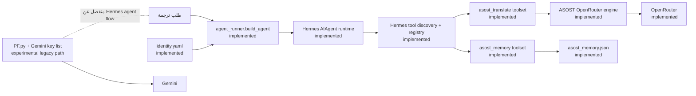
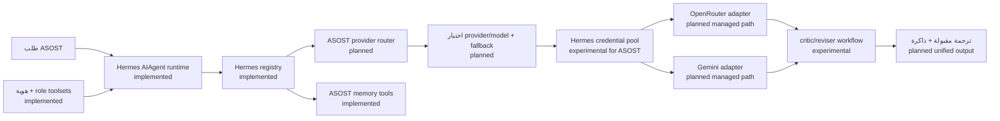

# خارطة تكامل ASOST مع Hermes

## المبدأ المعماري

ASOST **يمدّد Hermes ولا يعيد بناء runtime**. يوفر ASOST هويات الوكلاء،
الـ toolsets، والأدوات المسجّلة، بينما يحتفظ Hermes بمسؤولية دورة الوكيل،
استدعاء النماذج، الجلسات، اكتشاف الأدوات، وتنفيذها. لذلك يجب أن تمر أي قدرة
جديدة عبر واجهات Hermes القائمة بدلاً من إنشاء حلقة تشغيل موازية.

### مفتاح الحالات

- **implemented** — موجود في المسار التشغيلي الحالي.
- **experimental** — متاح للاختبار، لكنه ليس المسار الافتراضي المضمون.
- **planned** — تصميم مستهدف وغير منفذ بعد.

## متغيرات البيئة

| المتغير | الحالة | الغرض |
|---|---|---|
| `HERMES_HOME` | **implemented** | يحدد ملف تعريف Hermes وحالته، بما فيها `auth.json`. يضبطه `agent_runner` على `hermes-home` داخل المشروع. |
| `OPENROUTER_API_KEY` | **implemented** | اعتماد مباشر لـ OpenRouter مع fallback قديم إلى `assost-main/.env`. يفضّل credential store للتشغيل المُدار. |
| `ASOST_OR_MODEL` | **implemented** | يغيّر نموذج OpenRouter الافتراضي لمحرك ASOST. |
| `ASOST_GEMINI_KEYS` | **implemented** | مفاتيح Gemini مفصولة بفواصل للمسار القديم في `PF.py`. |
| `ASOST_API_TOKEN` | **implemented** | توكن مصادقة عمليات الكتابة في ASOST API عبر `X-ASOST-Token`. |
| `ASOST_SKIP_KEY_TEST` | **implemented** | القيمة `1` تتجاوز اختبار مفاتيح Gemini عند إقلاع خادم ASOST. |

لا تسجّل القيم أو تضعها في Git أو الأمثلة. أسماء المتغيرات ليست أسراراً؛ قيمها
أسرار. عند استخدام credential store، تأكد أولاً أن `HERMES_HOME` يشير إلى ملف
ASOST الصحيح حتى لا تُحفظ الاعتمادات في profile آخر.

## إضافة الاعتمادات إلى Hermes credential store

نفّذ الأوامر تفاعلياً كي يطلب Hermes المفتاح بإدخال مقنّع؛ لا تمرر المفتاح في
سطر الأوامر، لأن arguments قد تظهر في shell history أو قائمة العمليات:

```bash
export HERMES_HOME="$PWD/hermes-home"

# الصق المفتاح عند مطالبة Hermes، لا داخل هذا الأمر.
hermes auth add openrouter --type api-key --label asost-openrouter
hermes auth add gemini --type api-key --label asost-gemini

# تحقق من metadata فقط؛ لا يطبع هذا الأمر المفتاح الكامل.
hermes auth list
```

يمكن تكرار `auth add` لإضافة أكثر من اعتماد ودعم تدوير المفاتيح. لا تعدّل
`hermes-home/auth.json` يدوياً، ولا تنسخ محتواه إلى تقرير أو commit. يبقى
`ASOST_GEMINI_KEYS` مسار توافق قديم إلى أن يكتمل توجيه Gemini عبر credential
pool؛ تخزين مفتاح Gemini في Hermes وحده لا يجعل محرك `PF.py` يستهلكه حالياً.

## مخطط workflow الحالي



في المسار الحالي، يسجل `hermes/tools/asost_tools.py` أدوات الترجمة والذاكرة،
ويفعّل `agent_runner` الـ toolsets حسب الدور. وسيط اختيار محرك الترجمة موجود
شكلياً، لكن `auto` يوجه إلى OpenRouter فقط. مسار Gemini منفصل وقديم.

## مخطط workflow المستهدف



### خطوات الطريق

1. **implemented:** الإبقاء على `AIAgent` باعتباره runtime الوحيد وتفعيل قدرات
   ASOST بواسطة toolsets والأدوات المسجّلة.
2. **experimental:** اختبار اعتمادات OpenRouter وGemini المخزنة في Hermes مع
   تدفقات ASOST من دون كشف القيم أو تغيير ملفات الاعتماد يدوياً.
3. **planned:** جعل موجه المزود يستهلك credential pool مباشرة، وإزالة fallback
   ملفات `.env` وقائمة `ASOST_GEMINI_KEYS` بعد توفير مسار ترحيل.
4. **planned:** توحيد الترجمة والنقد والمراجعة تحت orchestration الخاص بـ Hermes،
   مع إبقاء المحركات قدرات/أدوات لا runtimes مستقلة.
